# Veil Analytics — User Guide

A complete explanation of what this system does, why it is built the way it
is, and how to operate every screen in it. Screenshots throughout are from a
real run against 101,766 hospital records.

If you only want to install and run the project, see the
[README](../README.md). This document assumes it is already running.

---

## Table of contents

1. [What this project is](#1-what-this-project-is)
2. [The problem it solves](#2-the-problem-it-solves)
3. [How it works](#3-how-it-works)
4. [Roles](#4-roles)
5. [Signing in](#5-signing-in)
6. [Loading a dataset](#6-loading-a-dataset)
7. [Reading the release schema](#7-reading-the-release-schema)
8. [The workspace overview](#8-the-workspace-overview)
9. [Composing a release](#9-composing-a-release)
10. [Reading a grouped result](#10-reading-a-grouped-result)
11. [Bounded means, and a lesson in honest error](#11-bounded-means-and-a-lesson-in-honest-error)
12. [The privacy ledger](#12-the-privacy-ledger)
13. [Release history](#13-release-history)
14. [Team access](#14-team-access)
15. [The audit log](#15-the-audit-log)
16. [Settings](#16-settings)
17. [What the system refuses to do](#17-what-the-system-refuses-to-do)
18. [Known limitations](#18-known-limitations)

---

## 1. What this project is

Veil Analytics is a **differentially private analytics platform**. A data owner
uploads a sensitive dataset; analysts ask aggregate questions about it; the
system returns answers with calibrated random noise added, and permanently
deducts the cost of each answer from a fixed privacy budget.

The exact data never leaves the protected environment. Neither does the exact
answer. What crosses the boundary is a noisy number, together with an honest
statement of how much noise is in it.

The design goal is narrow and worth stating plainly: **make it impossible to
release something that looks precise but is not, and impossible to spend
privacy without recording it.**

---

## 2. The problem it solves

Aggregate statistics feel safe. They are not.

Publish enough sums, counts, and averages over the same dataset and the
underlying rows can be reconstructed — this is the Dinur–Nissim result, and it
is not theoretical: the US Census Bureau reconstructed a substantial share of
2010 respondents from published tables alone. "We only publish aggregates" is
not a privacy guarantee.

Differential privacy replaces that hope with a bound. Informally: the released
answer is almost as likely whether or not any single individual is in the
dataset. Formally, a mechanism is (ε, δ)-differentially private if for any two
datasets differing by one individual, and any set of outputs, the probability
of landing in that set differs by at most a factor of e^ε, plus δ.

The parameter ε is a **budget**, not a setting. Every answer spends some. Once
it is gone, the dataset can no longer be queried — because further answers
would erode the guarantee that was promised.

Three things follow, and this system implements all three:

- **Noise must be calibrated to the right unit.** If one person appears in 40
  rows, protecting "one row" protects nothing.
- **The budget must be enforced, not advertised.** Spend must be atomic and
  irreversible.
- **The error must be reported.** An answer without its uncertainty invites
  the reader to treat noise as signal.

---

## 3. How it works

Four components, separated by one hard trust boundary. Everything above the
boundary handles *permission and accounting*; only the component below it ever
sees a row of data.

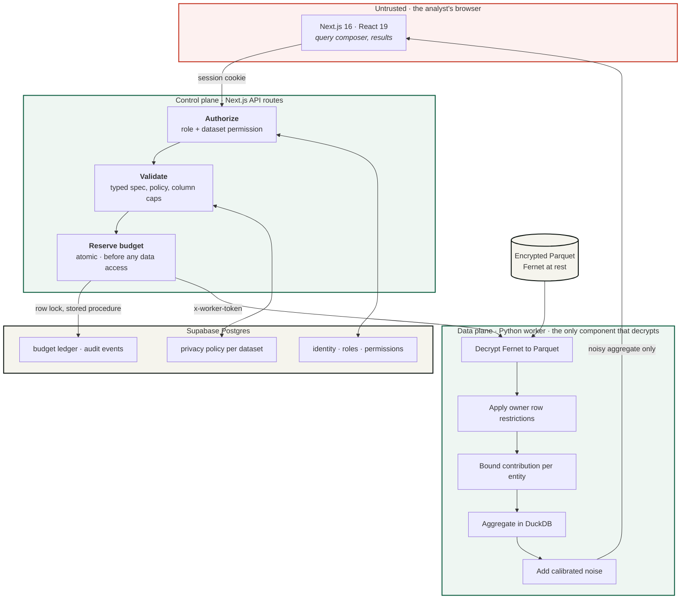

**The control plane never touches raw data.** It authenticates the caller,
validates the query against the dataset's policy, reserves budget, and forwards
the request. What comes back is already noisy.

**The worker is the only component that decrypts.** Four transformations happen
in a fixed order before any number is returned, and the order is the guarantee:
restrict rows, bound each entity's contribution, aggregate, then add noise
calibrated to the sensitivity that the bound implies. Reversing any two of
those would break the calibration.

### The query lifecycle

The ordering below is the single most important design decision in the system.
Budget is charged *before* the data is touched, and never given back.

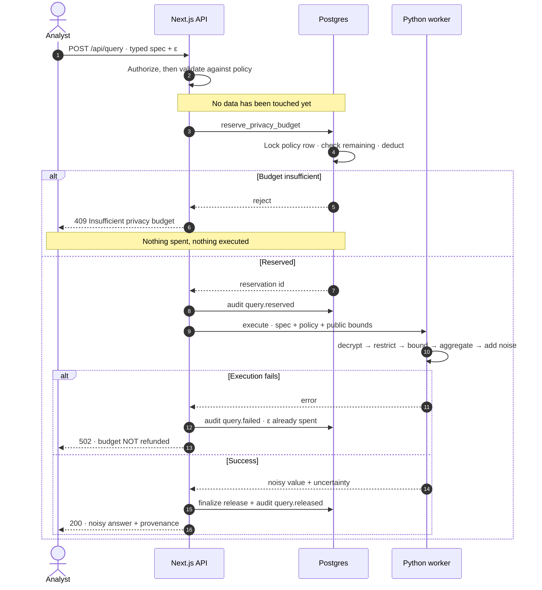

Step 4 is why a failed release still costs budget. Refunding on failure would
hand an attacker a free oracle: induce an error, learn something from whether
it occurred, pay nothing. The cost is charged for *touching* the data, not for
succeeding.

### The mechanisms

| Mechanism | Used for | Guarantee |
| --- | --- | --- |
| Laplace | counts, grouped counts, sums, means | pure ε-DP |
| Gaussian (analytic) | counts, sums | (ε, δ)-DP |
| Exponential | top-k selection | pure ε-DP |

Gaussian calibration uses the **Balle–Wang (2018) analytic method**, not the
classical Dwork–Roth bound. The classical bound is only valid for ε ≤ 1 and
silently under-noises above it; the analytic method is exact for all ε.

### Composition

Costs add. Two releases at 0.4 ε each leave the dataset having spent 0.8 ε of
its total — this is sequential composition, and it is the conservative,
defensible accounting. The ledger shows the running total.

---

## 4. Roles

| Role | Can do |
| --- | --- |
| **Owner** | Everything: upload, set policy, invite, grant permissions |
| **Admin** | Upload, set policy, invite, manage datasets |
| **Analyst** | Run queries on datasets they have been granted |

Dataset-level permissions layer on top of the organization role:
`view_schema`, `run_queries`, `manage_dataset`, `view_audit_log`. An analyst
with no grants sees no datasets.

---

## 5. Signing in

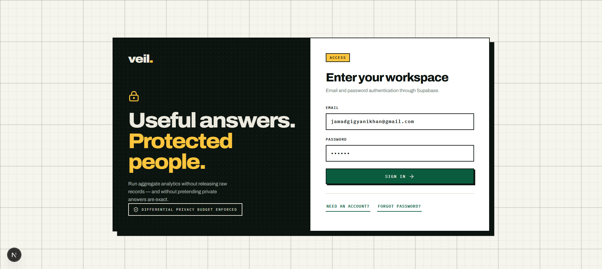

Email and password, via Supabase Auth. On first sign-in the app provisions a
workspace: an organization, a demo dataset, a privacy policy, and 1,200 seeded
synthetic records pushed through the worker. That takes a few seconds.

The demo dataset exists so the app is never empty. Everything below uses a real
dataset instead.

---

## 6. Loading a dataset

Go to **02 Datasets** and scroll to **Add a protected dataset**.

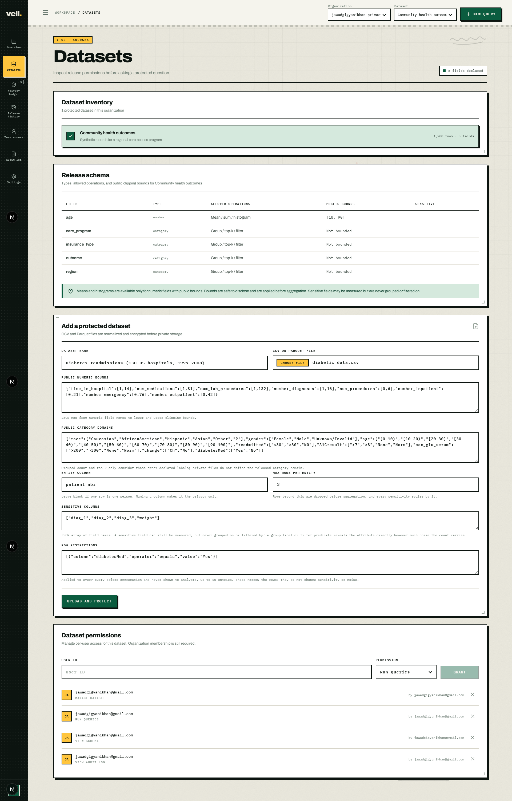

This form is where the privacy guarantee is actually defined. Every field
changes what the system will later permit or refuse.

The example uses the **Diabetes 130-US Hospitals (1999–2008)** dataset from the
UCI Machine Learning Repository — 101,766 hospital encounters, 50 columns.

| Field | Value |
| --- | --- |
| Dataset name | `Diabetes readmissions (130 US hospitals, 1999-2008)` |
| CSV or Parquet file | `diabetic_data.csv` |
| Entity column | `patient_nbr` |
| Max rows per entity | `3` |

**Public numeric bounds**

```json
{"time_in_hospital":[1,14],"num_medications":[1,81],"num_lab_procedures":[1,132],"number_diagnoses":[1,16],"num_procedures":[0,6],"number_inpatient":[0,21],"number_emergency":[0,76],"number_outpatient":[0,42]}
```

**Public category domains**

```json
{"race":["Caucasian","AfricanAmerican","Hispanic","Asian","Other","?"],"gender":["Female","Male","Unknown/Invalid"],"age":["[0-10)","[10-20)","[20-30)","[30-40)","[40-50)","[50-60)","[60-70)","[70-80)","[80-90)","[90-100)"],"readmitted":["<30",">30","NO"],"A1Cresult":[">7",">8","None","Norm"],"max_glu_serum":[">200",">300","None","Norm"],"change":["Ch","No"],"diabetesMed":["Yes","No"]}
```

**Sensitive columns**

```json
["diag_1","diag_2","diag_3","weight"]
```

**Row restrictions**

```json
[{"column":"diabetesMed","operator":"equals","value":"Yes"}]
```

### Why each field exists

**Entity column and max rows per entity.** This is the single most important
control on the form. This dataset has 101,766 encounters belonging to only
**71,518 distinct patients** — one patient appears 40 times. Without an entity
column, noise is calibrated to *one row*, which protects an encounter but not a
person. Naming `patient_nbr` makes the patient the privacy unit; the worker
then keeps at most 3 rows per patient before aggregating, and every sensitivity
scales by 3.

The bound is a real trade-off, measured on this dataset:

| Max rows per entity | Rows retained |
| --- | --- |
| 1 | 70.3% |
| 2 | 86.8% |
| **3** | **93.0%** |
| 5 | 97.5% |
| 10 | 99.5% |

A higher bound keeps more data but multiplies the noise. `3` keeps 93% at 3×
sensitivity.

**Public numeric bounds.** A column cannot be measured without them. They clip
values before aggregation, which is what makes sensitivity finite. They must be
publicly defensible facts — a hospital stay is 1–14 days because that is how
the dataset is defined, not because you looked at the maximum. Deriving a bound
from the data leaks the data.

**Public category domains.** A grouped release is refused without one. The
owner declares the label set; the system never infers it. This is not
bureaucracy: the *set of labels present in the data* is itself disclosive. If a
category appears only when one specific person is in the dataset, publishing
the observed label set reveals their presence regardless of the noise on the
count.

**Sensitive columns.** These may still be **measured** — a noisy mean or
histogram over them is fine — but never used to **group** or **filter**. A
group label or a filter predicate reveals the attribute directly, no matter how
much noise the count alongside it carries. `diag_1/2/3` are ICD-9 diagnosis
codes; `weight` is included because it is 97% missing and therefore its
presence is itself informative.

**Row restrictions.** Owner-defined predicates AND-ed into every query before
aggregation. The example restricts all analysis to encounters where diabetes
medication was prescribed. Analysts are told *how many* restrictions applied,
never *what they are* — a predicate can itself encode a sensitive attribute.

Press **Upload and protect**. About 20 seconds later:

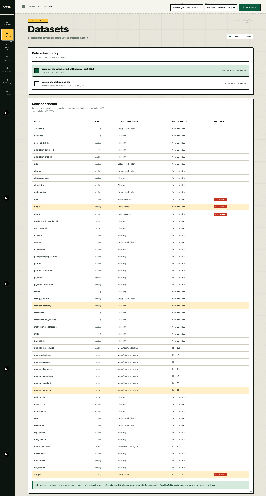

**"Uploaded 101,766 protected rows."** The file has been normalized to Parquet,
encrypted with Fernet, and written to protected storage. The original CSV is
not retained.

---

## 7. Reading the release schema

The **Release schema** table (above) is the contract between owner and analyst.
It states, per column, exactly what may be released.

| Allowed operations | Meaning |
| --- | --- |
| `Group / top-k / filter` | Has a declared public category domain |
| `Mean / sum / histogram` | Has public numeric bounds |
| `Filter only` | Usable as a filter, but cannot be grouped or measured |
| `Not releasable` | Marked sensitive and not numerically measurable |

Note `diag_1`, `diag_2`, `diag_3` and `weight` carry a red **SENSITIVE** badge
and read **Not releasable**. Note also that `encounter_id`, `patient_nbr`, and
the drug columns read **Filter only** — they are not offered for grouping,
because grouping by a patient identifier would request one group per person.

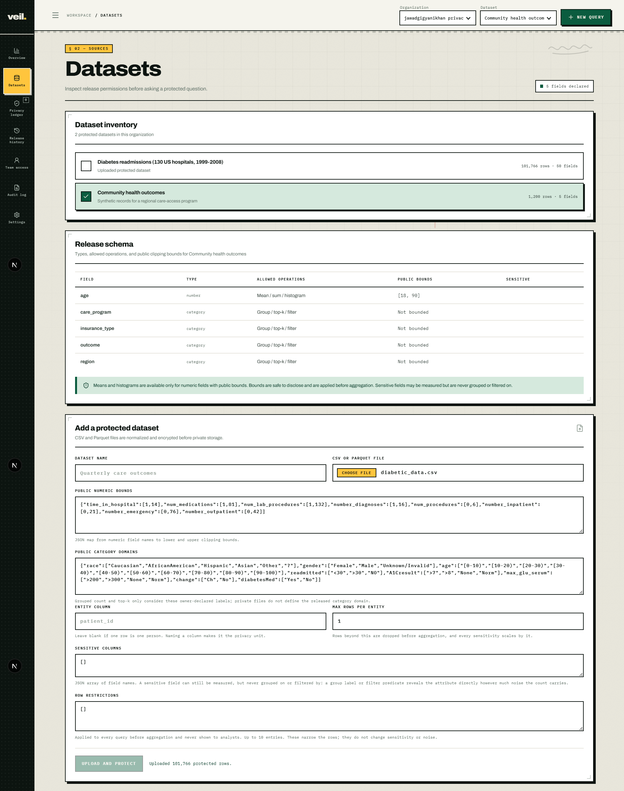

**Dataset inventory** lists every protected dataset in the organization with
its row and field counts. Selecting one here, or from the **Dataset** dropdown
in the top bar, changes what every other screen operates on. Each dataset
carries its **own independent privacy budget**.

---

## 8. The workspace overview

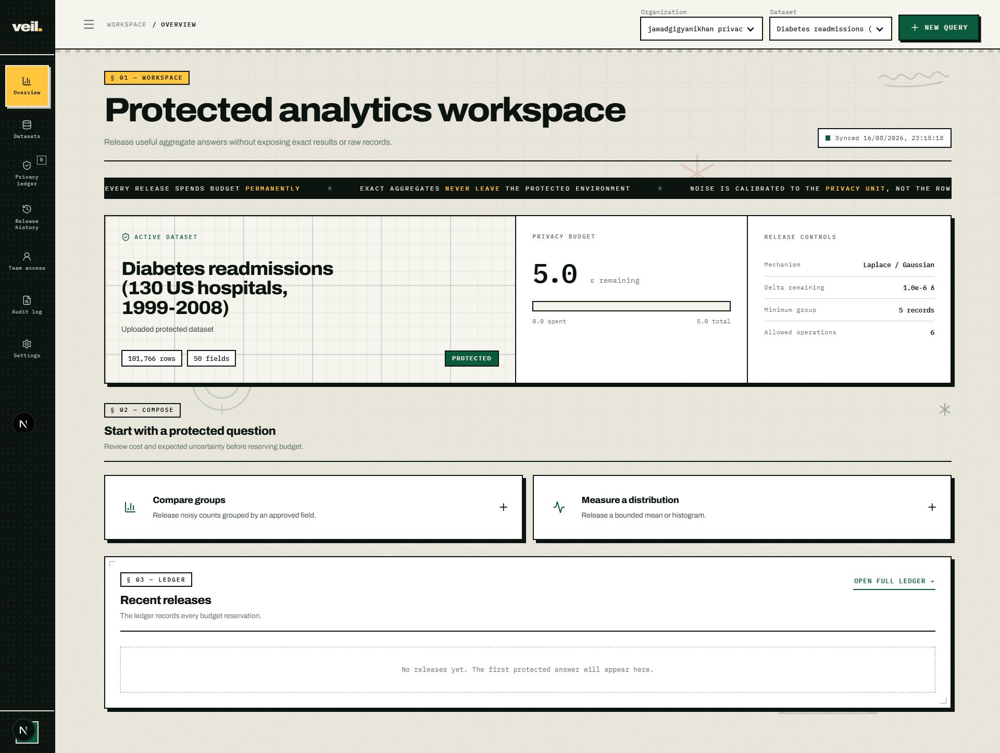

Three panels:

- **Active dataset** — 101,766 rows, 50 fields, status PROTECTED.
- **Privacy budget** — 5.0 ε remaining of 5.0 total, nothing spent yet. This
  meter only ever moves one way.
- **Release controls** — the mechanisms available, delta remaining, the minimum
  group size (5 records), and how many operation types are enabled.

The scrolling banner is a standing reminder of the three rules that govern
everything below it: budget is spent permanently, exact aggregates never leave
the protected environment, and noise is calibrated to the privacy unit rather
than the row.

Below, **Compose a protected question** offers the two entry points, and the
ledger reads *"No releases yet."*

---

## 9. Composing a release

Press **+ New query**, or the **Compare groups** card.

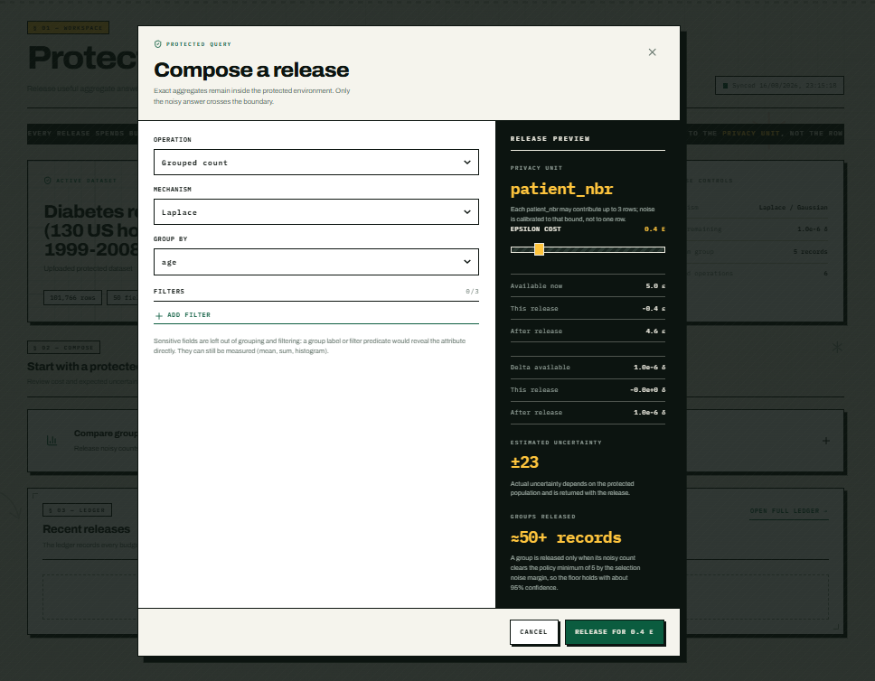

| Field | Value |
| --- | --- |
| Operation | `Grouped count` |
| Mechanism | `Laplace` |
| Group by | `age` |
| Epsilon | `0.4` |

The right panel is the point of this screen. **Nothing has been spent yet**, and
it already tells you:

- **Privacy unit: `patient_nbr`** — "Each patient_nbr may contribute up to 3
  rows; noise is calibrated to that bound, not to one row."
- **Budget arithmetic** — available 5.0 ε, this release −0.4 ε, after 4.6 ε.
  Delta is untouched because Laplace spends no delta.
- **Estimated uncertainty ±23.**
- **Groups released ≈50+ records** — "A group is released only when its noisy
  count clears the policy minimum of 5 by the selection noise margin, so the
  floor holds with about 95% confidence."

The **Group by** list contains 8 of the 50 columns — only those with declared
public category domains. Sensitive columns are absent entirely.

The button reads **RELEASE FOR 0.4 ε**. The cost is on the button because the
click is irreversible.

---

## 10. Reading a grouped result

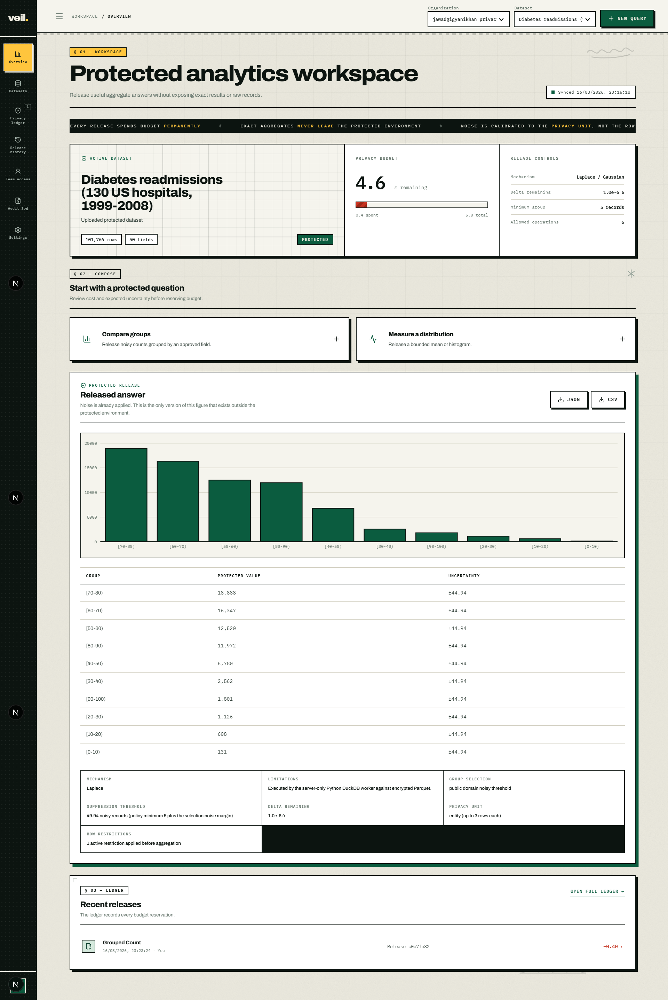

Budget has moved to **4.6 ε**. The result is a chart, a table, and a block of
release notes.

| Group | Protected value | Uncertainty |
| --- | --- | --- |
| [70-80) | 18,888 | ±44.94 |
| [60-70) | 16,347 | ±44.94 |
| [50-60) | 12,520 | ±44.94 |
| [80-90) | 11,972 | ±44.94 |
| [40-50) | 6,780 | ±44.94 |
| [30-40) | 2,562 | ±44.94 |
| [90-100) | 1,801 | ±44.94 |
| [20-30) | 1,126 | ±44.94 |
| [10-20) | 608 | ±44.94 |
| [0-10) | 131 | ±44.94 |

These numbers are **not** the true counts, and re-running the identical query
will produce different ones. That is the mechanism working.

The release notes are the part worth reading closely:

- **Mechanism** — Laplace.
- **Limitations** — "Executed by the server-only Python DuckDB worker against
  encrypted Parquet."
- **Group selection** — `public domain noisy threshold`.
- **Suppression threshold** — 49.94 noisy records: the policy minimum of 5 plus
  the selection noise margin. A group whose noisy count falls below this is
  dropped rather than published.
- **Delta remaining** — 1.0e-6 δ, unchanged.
- **Privacy unit** — `entity (up to 3 rows each)`.
- **Row restrictions** — `1 active restriction applied before aggregation`.

That last line is worth dwelling on. The analyst is told their population was
narrowed, so they do not mistake this for a count over all encounters. They are
**not** told the restriction is `diabetesMed = Yes`, because that predicate is
itself a clinical fact about the cohort.

**JSON** and **CSV** export the released answer with its uncertainty attached.

---

## 11. Bounded means, and a lesson in honest error

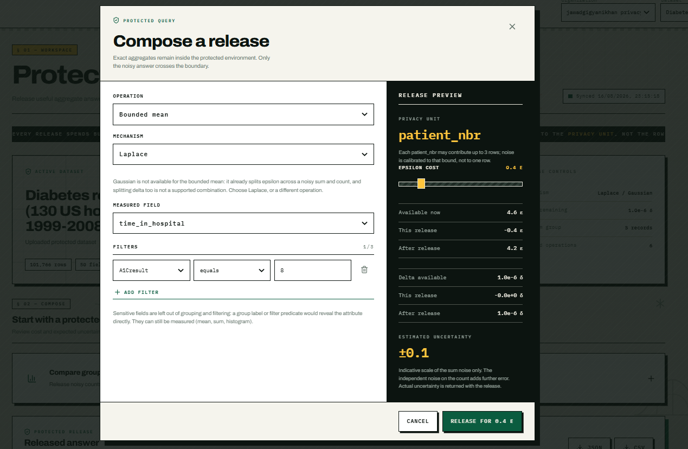

| Field | Value |
| --- | --- |
| Operation | `Bounded mean` |
| Mechanism | `Laplace` |
| Measured field | `time_in_hospital` |
| Filter | `A1Cresult` `equals` `8` |
| Epsilon | `0.4` |

Two things to notice before releasing.

**Gaussian is refused, with a reason.** "Gaussian is not available for the
bounded mean: it already splits epsilon across a noisy sum and count, and
splitting delta too is not a supported combination."

**The preview labels its own error as incomplete.** ±0.1, followed by
"Indicative scale of the sum noise only. The independent noise on the count
adds further error." A bounded mean is a noisy sum divided by a noisy count;
the preview can only model one of the two.

The result:

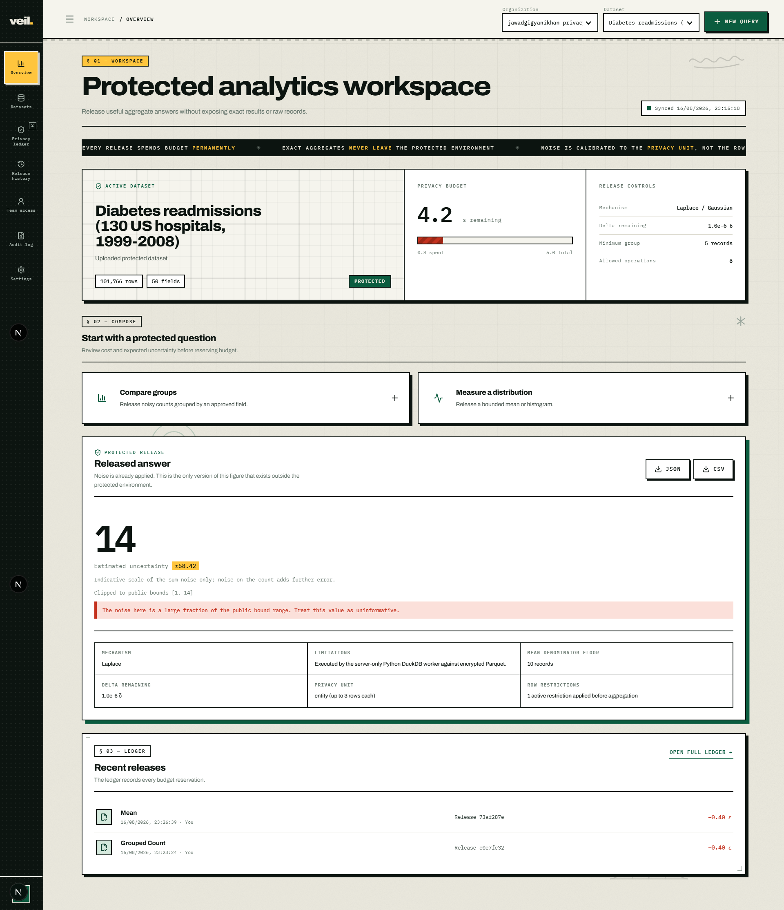

**14, with estimated uncertainty ±58.42**, and a red warning:

> The noise here is a large fraction of the public bound range. Treat this
> value as uninformative.

This is the most instructive screenshot in the set, so here is exactly what
happened.

The filter was `A1Cresult equals 8`. The declared domain for `A1Cresult` is
`[">7", ">8", "None", "Norm"]` — there is no bare `8`. **The filter matched zero
rows.** The mean was then computed over an empty set: the noisy sum was
divided by the public minimum denominator of 10 records, and the result was
clamped to the public upper bound of 14.

Three correct behaviours are visible at once:

1. **The error channel stayed data-independent.** A filter matching nothing
   returned HTTP 200 and a normally-shaped answer — same fields, same
   structure — exactly as a filter matching thousands of rows would. Had it
   raised an error instead, the *presence of the error* would have revealed
   that the result set was empty, which is itself a fact about the data.
2. **Budget was still spent.** 0.4 ε, gone. The query touched the data; the
   cost is real whether or not the answer is useful.
3. **The system refused to let the number be misread.** ±58.42 against a bound
   range of 13 is meaningless, and the interface says so in as many words
   rather than presenting `14` as a finding.

A system that returned `14` with no caveat would be worse than useless here. If
you want the intended result instead, use `>8` as the filter value.

---

## 12. The privacy ledger

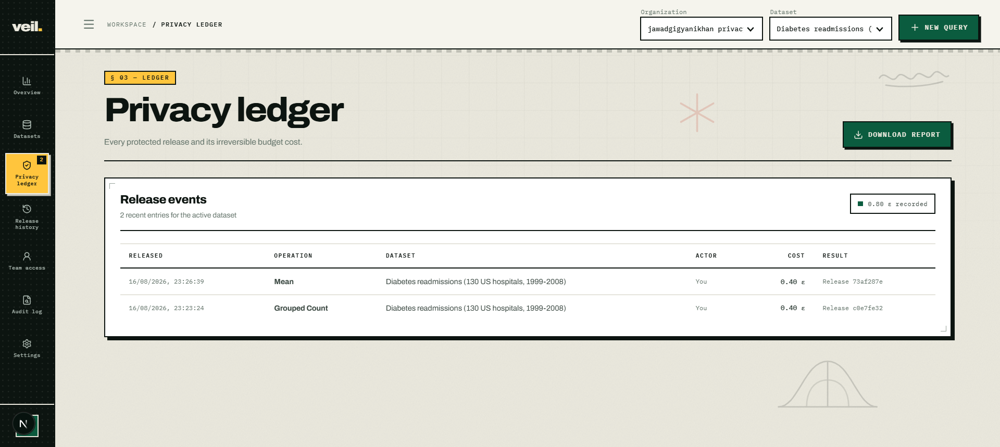

Every release and its irreversible cost: **0.80 ε recorded** across two
releases, each 0.40 ε, with a reference ID and actor.

**Download report** exports the ledger. This is the artifact you hand an
auditor: it accounts for every unit of privacy budget the dataset has spent.

---

## 13. Release history

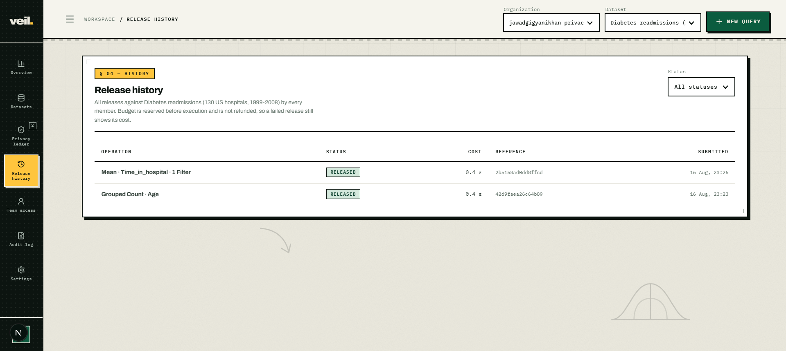

Per-dataset query history, filterable by status, showing the operation shape
(`Mean · Time_in_hospital · 1 Filter`), status, cost, and reference.

The description states the rule directly: *"Budget is reserved before execution
and is not refunded, so a failed release still shows its cost."* A `FAILED` row
with a non-zero cost is correct behaviour, not a bug.

---

## 14. Team access

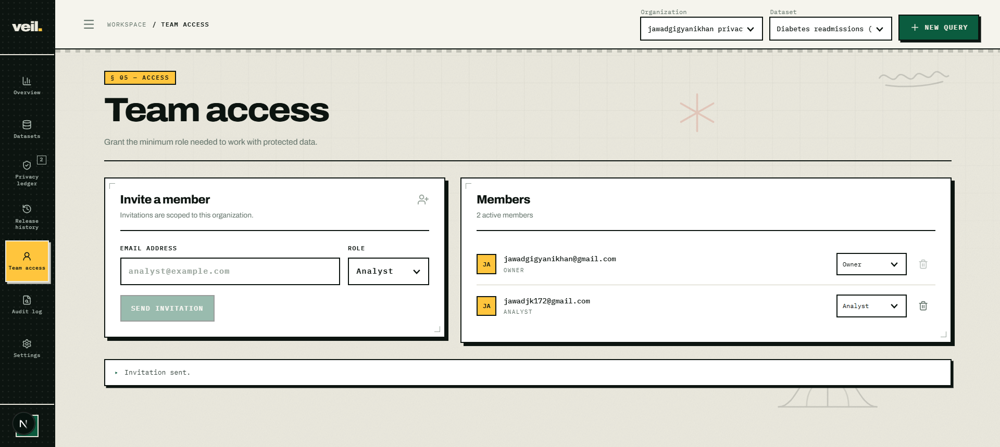

Invite by email with a role of Analyst or Admin. Existing members can be
promoted, demoted, or revoked. The owner cannot be revoked or demoted.

Membership grants access to the organization. Access to a *dataset* is granted
separately, under **Dataset permissions** at the bottom of the Datasets screen
— `view_schema`, `run_queries`, `manage_dataset`, `view_audit_log`. An analyst
with organization membership but no dataset grant sees nothing.

---

## 15. The audit log

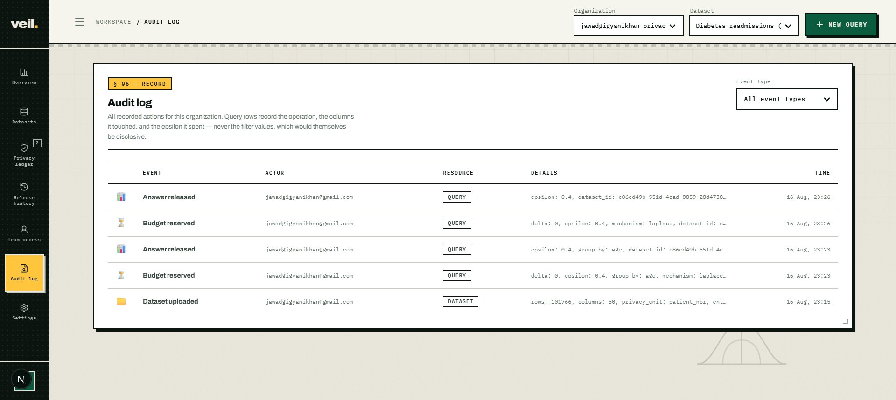

Every recorded action: dataset uploads, budget reservations, released answers,
failed releases, policy changes, permission grants and revocations.

Read one of the query rows carefully:

```
epsilon: 0.4, group_by: age, dataset_id: c86ed49b-551d-4c…
```

It records the operation, the columns touched, and the epsilon spent. It does
**not** record filter values — as the screen itself states, *"never the filter
values, which would themselves be disclosive."*

The consequence is precise: two queries filtering the same column on different
values produce **byte-identical** audit metadata. An auditor can verify how much
budget was spent and against which columns, and still cannot learn which value
an analyst was hunting for. An audit log that recorded predicates would become
a second copy of the sensitive data, held in the one place everybody is allowed
to read.

The reservation event is written **before** execution, so a query that fails
still leaves both a `Budget reserved` row and a `Release failed` row carrying
the consumed epsilon.

---

## 16. Settings

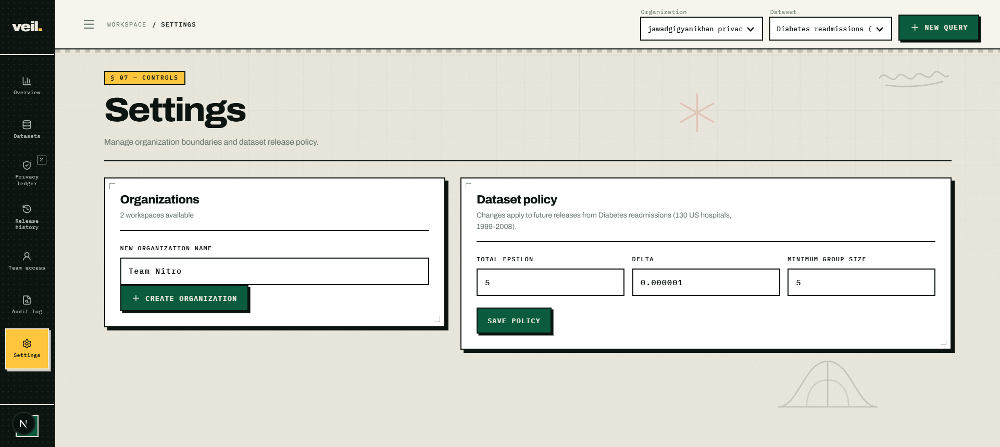

**Organizations** — create a new workspace. Datasets, budgets, members, and
audit trails are scoped to an organization and never cross between them.

**Dataset policy** — total epsilon, delta, and minimum group size for the
active dataset. Two guards apply: total epsilon cannot be set below what has
already been spent, and neither can delta. Raising the total is permitted and
is the only way to grant further queries on an exhausted dataset — that is a
deliberate, logged decision to weaken the guarantee, not a reset.

---

## 17. What the system refuses to do

The refusals are the product. Each is worth demonstrating.

**Group or filter on a sensitive column.** `diag_1` is absent from both the
Group by and Filter lists. Sent directly to the API, it returns
`'diag_1' is marked sensitive and cannot be used for grouping or filtering.`

**Group on a column with no declared domain.** The Group by list holds 8 of 50
columns. `patient_nbr` and `encounter_id` are not offered.

**Measure a column with no public bounds.** The Measured field list holds only
the 8 columns given bounds at upload.

**Exceed the budget.** Lower total epsilon in Settings to just above what is
spent, then attempt a release: `Insufficient privacy budget`, refused inside
the database transaction that would otherwise have spent it.

**Refund a failed release.** Budget is charged at reservation, before the
worker is called. A failure leaves the cost recorded.

**Leak through the error channel.** A filter matching zero rows returns a
normal, noisy answer — demonstrated in §11.

**Use Gaussian where it is not calibrated.** The bounded mean refuses it, with
the reason shown in the composer.

---

## 18. Known limitations

Stated plainly, because a privacy tool that overstates itself is worse than one
that does less.

- **Trusted curator model.** The worker sees plaintext. This is not local DP
  and not encrypted computation. The trust boundary is the worker process.
- **Floating-point noise.** Laplace and Gaussian sampling use floating-point
  arithmetic, which is vulnerable to the low-order-bit attack described by
  Mironov (2012). A discrete Laplace implementation using only integer and
  rational arithmetic is included in `packages/dp-core` and used where
  applicable; the snapping mechanism and a discrete Gaussian are not
  implemented.
- **Sequential composition only.** Costs add linearly. Rényi and zero-concentrated
  DP accounting would give tighter bounds for large query volumes and are not
  implemented.
- **Contribution bounding is a policy claim.** The system enforces the bound
  the owner declares. If the true maximum contribution exceeds it, the promised
  guarantee is not met — the bound must be set from knowledge of the data
  generating process.
- **Performance.** Roughly 4 seconds per query; the worker decrypts and reads
  the Parquet on every request, with no caching layer.
- **Timing side channels are not addressed.** Execution time may correlate with
  result-set size.
